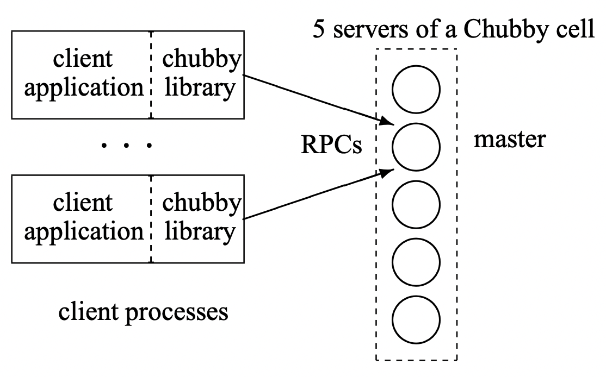
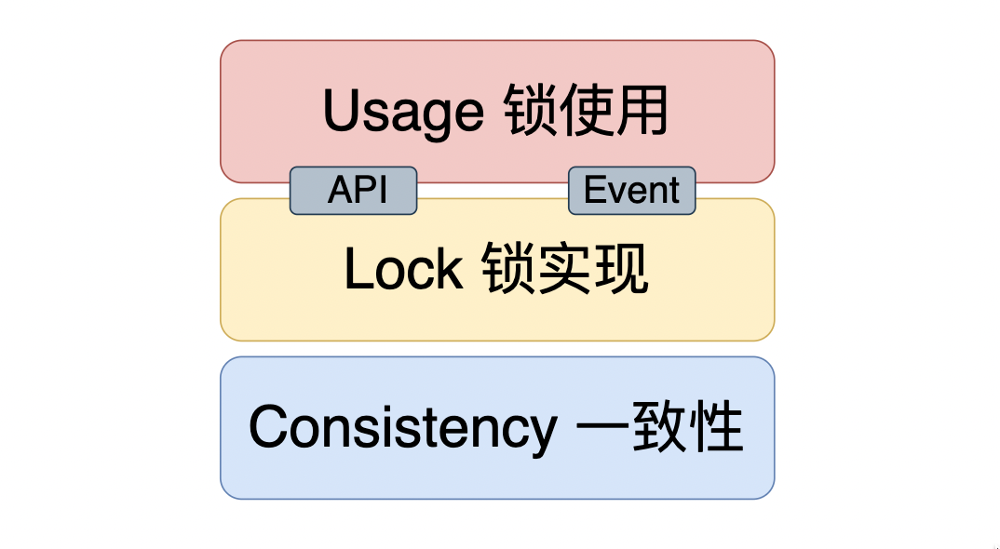
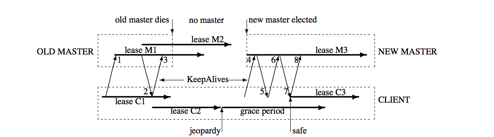

# Chubby锁

- [Chubby锁](#chubby锁)
  - [概念](#概念)
  - [架构](#架构)
    - [一致性](#一致性)
    - [分布式锁实现](#分布式锁实现)
      - [文件系统](#文件系统)
      - [锁接口](#锁接口)
      - [锁实现](#锁实现)
    - [锁使用](#锁使用)
  - [特性思考与对比](#特性思考与对比)
  - [参考](#参考)

## 概念

Chubby 是 Google 设计的提供粗粒度锁的分布式锁服务，其主要设计思想发表在2006年的论文[The Chubby lock service for loosely-coupled distributed systems](https://www.usenix.org/legacy/event/osdi06/tech/full_papers/burrows/burrows_html/)上。诸如GFS 和 Bigtable 都使用了 Chubby 以解决主节点的选举等问题。

> *Chubby provide **coarse-grained** locking as well as **reliable** storage for a **loosely-coupled** distributed system.*

Chubby论文中描述到，Chuuby为松耦合的分布式系统提供粗粒度锁定和可靠存储。

- *粗粒度*：相对于细粒度，粗力度追求的是时间范围更长，可能横跨数小时甚至数天的时间跨度。
- *松耦合*：松耦合与紧耦合是两种分布式架构设计思想，松耦合架构中，各个组件依赖关系较弱，便于独立地修改和扩展。在松耦合的系统下，也更适宜引入锁服务。关于为什么不引入一致性库或一致性服务，论文作者总结了如下几点：
  - 系统开发者可能并不会在一开始就考虑高可用，而后期系统规模增加后，选择锁服务来保证一致性的代价最小；
  - 分布式系统在选主时可能需要读写少量的节点数据，而Chubby锁服务可以很好地实现该功能；
  - 锁接口的使用易于理解；
  - 锁服务可以减少对接的业务节点数量

Chubby锁实际是一种服务，提供了粗粒度的锁和可靠的小容量存储。

## 架构

Chubby的设计初衷是实现一个分布式锁，一个典型的Chubby实例如下所示：

  

- Chubby包括**服务端**与**客户端**两个部分；
- 客户端通过 Chubby Library与服务端交互；
- 服务端由多个节点（一般是5个）组成集群提供高可用服务。

完整的Chubby分布式锁服务包含三个层面支持：一致性、锁实现和锁使用，Chubby提供了易于理解的API，用户可以通过API来直接获取/释放锁资源。这三个层面可描述如下图：

  

### 一致性

一致性协议并不直接和锁的概念相关，但是实际环境中总是可能存在节点宕机、网络波动等情况。为了保障锁服务的可用性，需要引入分布式架构，而分布式的节点需要保障一致性。
Chubby的一致性实现概要如下：

- 多台服务器（对应多个数据副本）组成一个集群，集群通过一致性协议选出一个Master，在确定租期内保证这个Master的领导地位；
- Master周期性地向所有副本刷新延长租期；
- 读写操作只能由Master发起，每个副本通过一致性协议维护一份数据备份；
- Master宕机或网络断开后，其他副本可以发起选主选出新的Master。

Chubby采用的是**Multi-Paxos算法**，Chubby系统通过该共识算法实现数据强一致性，在完成一致性构建后，用户在使用过程中只需将Chubby集群视作一个高可用的节点即可。
本笔记不涉及一致性协议的底层原理和实现，只会使用Master和集群等概念。

### 分布式锁实现

#### 文件系统

Chubby对外提供了一套与Unix文件系统非常相近但是更简单的访问接口。Chubby的数据结构可以看作是一个由文件和目录组成的树，其中每一个节点都可以表示为一个使用斜杠分割的字符串，典型的节点路径表示如下：
`/ls/foo/wombat/pouch`
其中，`ls`是所有Chubby节点所共有的前缀，代表着锁服务，是*Lock Service*的缩写；`foo`则指定了Chubby集群的名字，从DNS可以查询到由一个或多个服务器组成该Chubby集群；剩余部分的路径`/wombat/pouch`则是一个真正包含业务含义的节点名字，由Chubby服务器内部解析并定位到数据节点。

Chubby的命名空间包括**文件**和**目录**，我们称之为节点（**Node**，我们以数据节点来泛指Chubby的文件或目录）。在同一个Chubby集群数据库中，每一个节点都是全局唯一的。和Unix系统一样，每个目录都可以包含一系列的子文件和子目录列表，而每个文件中则会包含文件内容。与Unix系统不同的是，Chubby没有符号链接和硬连接的概念。

Chubby上的每个数据节点都分为**持久节点**（permanent ）和**临时节点**（Ephemeral）两大类，其中持久节点需要显式地调用接口API来进行删除，而临时节点则会在其对应的客户端会话失效后被自动删除。也就是说临时节点的生命周期和客户端会话绑定，因此我们可以通过临时节点来间接判断客户端的状态。

Node除了记录数据之外，还包括了一些元信息：

- **ACL** (Access Control List，访问控制列表)：用于权限控制
- 4个**单调递增**的64位编号：
  - 实例编号
  - 内容版本号
  - 锁版本号
  - ACL版本号

#### 锁接口

Chubby提供了丰富且易于理解的API：

- 获取及关闭Handle（文件句柄）接口：`Open`, `Close`
- 获取释放锁接口：`Aquire`, `Release`
- 读取和修改Node内容接口：`GetContentAndStat`, `SetContent`,`Delete`
- 其他访问元信息、ACL、Sequencer（锁序列器）的接口

> Sequencer：锁序列器，是Chubby引入的用于定义某个锁资源的字符串。由三部分组成：锁名称、锁类型（排他或共享）、锁版本号。客户端在操作资源时，可以发送本地维护的Sequencer来确定当前是否正确获取到锁。

#### 锁实现

在Chubby中，任意一个Node都可以被当做一个读写锁：一种是单个客户端排他（写）模式持有这个锁，另一种则是任意数目的客户端以共享（读）模式持有这个锁。

> Chubby放弃了严格的强制锁，客户端可以在没有获取任何锁的情况下访问Chubby的文件。是一种建议锁的思想，需要使用者自己控制锁的使用逻辑。

用户通过`Aquire`、`Release`等接口对Node进行操作，从而获取和释放锁。在分布式环境下，节点和网络的不可靠可能导致**消息延迟**和**消息重排**，对锁安全性带来挑战。为了解决这些问题，Chubby引入了 **锁延迟**（Lock-delay） 和 锁序列器（**Sequencer**）：

- **锁延迟**：Chubby 允许客户端为持有的锁指定一个 lock-delay 的时间值，当 Chubby 发现客户端被动失去联系的时候，并不会立即释放锁，而是会在 lock-delay 指定的时间内阻止其它客户端获得这个锁。锁延迟可以防止某些客户端因为网络波动而断开连接。
- **Sequencer**：锁序列器（包含锁的名字、锁模式、锁序号三个信息），客户端进行一些需要锁机制保护的操作时，可以将该锁序列器一并发送给服务端，服务端收到该请求后，会首先检测该序列器是否有效，以及检查客户端是否处于恰当的锁模式，如果没有通过检查，那么服务端就会拒绝该客户端的请求。

**使用锁的流程**
按照是否使用Sequencer，锁的具体使用流程可分为完整实现和简易实现，以完美实现为例，具体流程如下：

- 客户端发起`Aquire`请求，同时Master生成一个包含Lock版本号和锁类型的Sequencer；
- Chubby Server在Lock相关节点的元信息中记录这个版本号，Lock版本号会在每次被成功`Aquire`时加一；
- 成功Aquire Lock的Handle中也会记录这个Sequencer；
- 该Handle的后续操作都可以通过**比较元信息中的Lock版本号和Sequencer判断锁是否有效**，从而接受或拒绝；
- 用户直接调用`Release`或Handle由于所属Client Session过期而失效时，锁被释放并修改对应的元信息。

**事件通知**

Chubby提供了Event事件通知机制来避免客户端轮询造成服务器压力，客户端向服务端注册通知事件后，当事件触发时，服务端就会以异步形式向服务端发送对应通知。常见的事件有：文件内容变更、节点删除、子节点变更、Master转移。

- 实现原理： *Todo...*

**缓存**

Chubby 的 Cache 可以缓存几乎所有的信息，包括数据，数据元信息，Handle信息及Lock。

> Chubby对自己的定位是需要支持大量的Client，并且*读请求远大于写请求的场景*，因此Chubby引入一个对读请求友好的客户端Cache，Chubby的机制是对Client透明的，客户端可以完全不感知这个Cache的存在。

Chubby客户端可以缓存自己所需的所有信息，这样的Cache对读请求的极度友好，但为了实现缓存一致性，Chubby牺牲了一定的写性能

- Master收到写请求时，**会先阻塞写请求**，通过返回所有客户端的KeepAlive来通知客户端，使各个客户端中的Cache失效；
- Client直接将自己的Cache清空并标记为Invalid，并发送KeepAlive向Master确认；
- Master收到所有Client确认或等到超时后再执行写请求。

**Session and KeepAlive**
Session可以看做是Client在Master上的一个投影，Master通过Session来管理维护Client，并通过周期性的 KeepAlive 握手来维护Session。
> 每个Session包括一个租约时间，在租约时间内Client是有效的，Session的租约时间在Master视角和Client视角由于网络传输时延及两端的时钟差异可能略有不同；

- Master和Client之间通过KeepAlive进行通信，Client发起KeepAlive，**会被Master阻塞在本地**，直到Session租约临近过期，此时Master会延长租约时间，并返回阻塞的KeepAlive通知Client。除此之外，Master还可能在Cache失效或Event发生时返回KeepAlive；
- Master除了正常的在创建连接及租约临近过期时延长租约时间外，故障恢复也会延长Session的租约；
- Client的租约过期会先阻塞本地的所有请求，进入危险（jeopardy）状态，并进入宽限期，等待额外的45s，以期待与Master的通信恢复。如果还是未能恢复，则返回用户失败。

**崩溃恢复**
Master发生故障后，Chubby会根据一致性协议选举出新的Master，新Master选出后，会进行崩溃恢复：

- 选择一个新的Epoch Num（拒绝携带老Epoch Num的客户端请求）；
- 恢复Session和锁信息，重置租约时间；
- Master开始接受新的客户端KeepAlive请求，第一个KeepAlive会由于Epoch错误而被Maser拒绝，同时向客户端返回最新的Epoch；之后第二个KeepAlive直接返回以通知Client设置本地的Session租约时间；接着Master Block第三个KeepAlive，恢复正常的通信模式；
- 从新请求中发现老Master创建的Handle时，新Master也需要重建，一段时间后，删除没有Handle的临时节点。

  

### 锁使用

Chubby论文中以一个选主场景对如何使用锁给出了详细的说明，以完美方案为例：

1. 所有Primary的竞争者，Open同一个Node，之后用得到的Handle调用Aquire来获取锁；
2. 只有一个成功获得锁，成为Primary，其他竞争者称为Replicas；
3. Primary将自己的标识通过SetContent写入Node；
4. Replicas调用GetContentsAndStat获得当前的Primary标识，并注册该Node的内容修改Event，以便发现锁的Release或Primary的改变；
5. Primary调用GetSequencer从当前的Handle中获得sequencer，并将其传递给所有需要锁保护的操作的Server；
6. Server通过CheckSequencer检查其sequencer的合法性，拒绝旧的Primary的请求。

## 特性思考与对比

**性能与适用场景**
Chubby实现了对客户端友好的Cache机制，因此读请求十分高效，但是也因此牺牲了一定写性能：每个写请求会先阻塞，然后服务端通知所有客户端Cache失效后才会执行这个写请求。
所以Chubby适用于**读多写少**的场景，例如分布式节点选主等。

**幂等**

## 参考

1. [Chubby论文：The Chubby lock service for loosely-coupled distributed systems](https://www.usenix.org/legacy/event/osdi06/tech/full_papers/burrows/burrows_html/)
2. [Chubby的锁服务](https://catkang.github.io/2017/09/29/chubby.html)
3. [Paxos Made Simple论文](https://www.microsoft.com/en-us/research/uploads/prod/2016/12/paxos-simple-Copy.pdf)
4. [Chubby与Paxos](https://www.cnblogs.com/leesf456/p/6005806.html)
