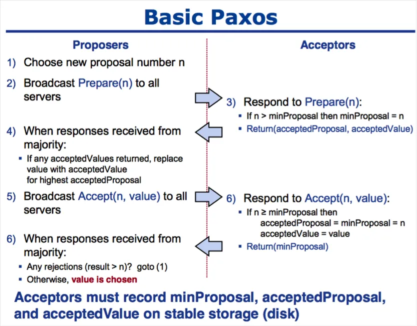
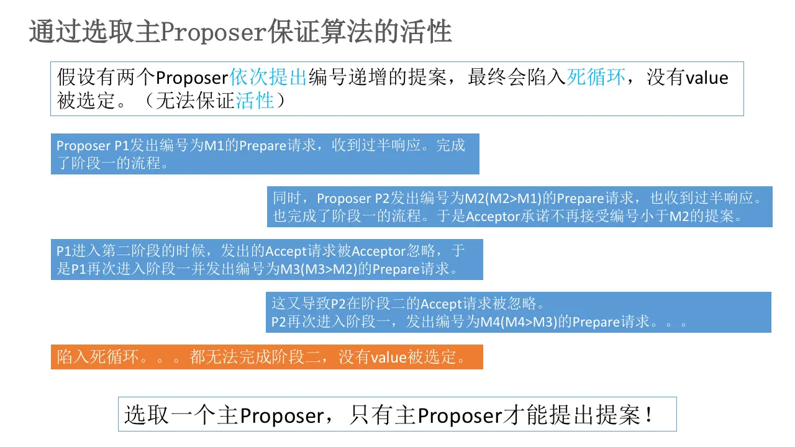
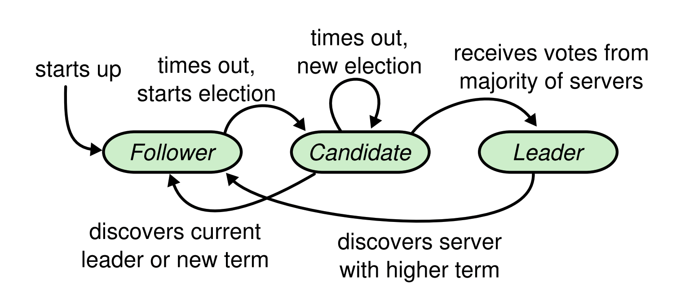

# 分布式协议

- [分布式协议](#分布式协议)
  - [前言](#前言)
  - [Paxos](#paxos)
  - [Raft](#raft)
    - [工程实现](#工程实现)
  - [补充](#补充)
  - [参考](#参考)

## 前言

在分布式系统中，总会发生诸如机器宕机或网络异常（包括消息的延迟、丢失、重复、乱序，还有网络分区）等情况。各个节点之间要保持数据一致性，就需要一种共识算法（分布式协议）来约束各个节点。

> 分布式场景中，存在“拜占庭将军问题”（Byzantine failures）：间隔很远的每支军队依靠信使传递信息，但某些将军可能叛变。要解决拜占庭将军问题，就需要在一个可能有叛徒的非信任环境中建立战斗共识。对应到分布式场景中，叛变的将军就是恶意节点，所以按照是否容忍拜占庭容错，可分为CFT类共识算法（非拜占庭容错，不考虑恶意节点）和BFT类共识算法（拜占庭容错，考虑恶意节点）。

下文中记录的两个共识算法都是CFT类（非拜占庭容错）共识算法。

## Paxos

**Paxos简介**：
Paxos是由Lamport大师提出的基于消息传递的分布式一致性算法，被视为当今分布式一致性算法的基石。Paxos系统中有三个角色：Proposer（提议者），Acceptor（决策者）和Learner（决策学习者）。其共识过程是Proposer提出提案来争取Acceptors的支持，当获得超过半数的支持时，则认为提案通过，发送提案结果给所有节点进行确认。在实际应用时，每个节点可以同时担任三种角色。

**Paxos流程**：
Paxos算法分为两个阶段，**Prepare**和**Propose**，具体如下：

- **阶段一**：
  **(a)** Proposer选择一个提案编号N，然后向Acceptor发送编号为N的Prepare请求。
  **(b)** 如果一个Acceptor收到一个编号为N的Prepare请求，且N大于该Acceptor已经响应过的所有Prepare请求的编号，那么它就会将它已经接受过的编号最大的提案（如果有的话）作为响应反馈给Proposer，同时该Acceptor承诺不再接受任何编号小于N的提案。
- **阶段二**：
  **(a)** 如果Proposer收到**半数以上**Acceptor对其发出的编号为N的Prepare请求的响应，那么它就会发送一个针对[N,V]提案的Accept请求给半数以上的Acceptor。注意：V就是收到的响应中编号最大的提案的value，如果响应中不包含任何提案，那么V就由Proposer自己决定。
  **(b)** 如果Acceptor收到一个针对编号为N的提案的Accept请求，只要该Acceptor没有对编号大于N的Prepare请求做出过响应，它就接受该提案。

  

Acceptor在收到Prepare请求时的两个承诺和一个应答：

1. 承诺不再接受Proposal ID小于等于当前请求的Prepare请求；
2. 承诺不再接受Proposal ID小于当前请求的Propose请求；
3. 应答已经Accept过的Propose中ID最大的那个提案的Value和ID，没有则返回空值。

**活锁问题**：
由于Paxos允许同时存在多个Proposer，在极端情况下，可能存在活锁问题：

  

Paxos被视为现在绝大多数共识算法的基石，但其也因难以理解而著名，并且Basic Paxos还存在一些工程实现上的问题需要考虑，所以在工程应用中，大多使用简化版本的Multi-Paxos或Raft。

**Multi-Paxos**：
上文提到，Paxos可能存在活锁问题，会导致系统进入死循环，其原因在于Basic Paxos允许同时存在多个Proposer。并且Basic Paxos只能对一个提案值形成决议，决议的形成至少需要两次网络来回（Preapare和Propose两个阶段）。在实际工程应用中，使用更多的是**Multi-Paxos**。
Multi-Paxos基于Basic Paxos做了以下改进：
在所有的Proposers中选举一个Leader，每次由Leader唯一地提交Proposal。这样由于没有Proposer竞争，避免了活锁问题，同时可以省略Prepare操作，提高效率。
选取Leader的阶段也是一次决议的形成，这一阶段需要运行一次Basic Paxos。Leader选取完成后，由于系统中只有一个Proposer，所以可以跳过Preapare阶段。

Chubby、ZooKeeper等框架的一致性算法都是基于Multi-Paxos实现的。

## Raft

> Raft的作用跟Multi-Paxos相同，但结构更加简单容易理解，是对Paxos的简化实现。
> "RAFT"四个字母是对Reliable, Replicated, Redundant, And Fault-Tolerant对缩写，利用[日志连续性]对Paxos做了很好的简化。

Raft系统中有三种角色：**Leader**、**Follower**和**Candidate**，其中Candidate在选举时才会出现。并且**同一时刻至多只有一个Leader**，Leader会负责所有外部的请求，如果Follower收到了请求，则会将请求路由到Leader。

**Raft流程**：

Raft通过分解问题，将一致性目标分解成了若干子问题，总结起来可分为这三个方面：Leader Election（主节点选举）、Log Replication（日志同步）、Safety（保证以上目标的约束条件）。

- **Leader Election**：关于主节点选举，这里直接列出Raft论文中使用状态机描述的图片，对节点角色的转变有很清晰 的描述：

  

  需要补充的两点是：在选取Leader时，总是会选取term（任期）最大、数据最全的那个节点；为了避免总是有大量节点同时发起投票，Raft引入了随机Time Out的机制来错开不同Candidate的投票过程。
  
- **Log Replication**：系统选出Leader后，就可以对外提供服务了，客户端只能直接和Leader进行交互。在Leader接受请求后，这个请求是`uncommited`状态，Leader将请求封装后通过RPC发送给Follower，Follower接收后返回ACK；在Leader收到大部分Follower的回复后，会将这条请求的状态设置为`commited`，并对客户端返回成功，此时这条消息就视为写入成功了，后续Leader会继续对Follower发送状态变更信息。
- **Safety**：在实际的场景中，可能会面临各种宕机、网络连接等问题，下面分析几种可能的宕机的情况：
  1. **Follower宕机**：Follower宕机后恢复的情况较为简单，恢复后直接重新加入集群并接收来自Leader的消息，同步数据即可。
  2. **Leader宕机**：Leader宕机的情况相对复杂，具体宕机时间节点可分为7种情况和1种网络分区情况，Raft协议可以很好地处理这些情况，并不会出现一致性问题，具体细节将在[崩溃恢复](#崩溃恢复)部分讨论。

**崩溃恢复**：

**Follower宕机**：Follower宕机后恢复的情况较为简单，恢复后直接重新加入集群并接收来自Leader的消息，同步数据即可。
**Leader宕机**：具体分为7种Leader宕机情况和1种网络分区情况：

1. 数据到达Leader前：此时Leader还未接收数据，不影响一致性；
2. 数据到达Leader，但还未同步到Follower：Follower上没有该数据，Follower重新选主后集群也没有数据，旧Leader恢复后成为Follower，同步数据后删除`uncommited`的数据，不存在一致性问题。
3. 数据到达Leader，同步到了所有Follower，但没有向Leader回复：重新选出的主节点具有该数据，会`commit`这个数据，不存在一致性问题。客户端都不会收到成功的响应，可进行重试，需要在工程实现时考虑**幂等**。
4. 数据到达Leader，同步到了大多数Follower，但没有向Leader回复：由于Raft要求节点只能投票给数据比自己更新的Candidate，并要求Candidate获取集群中过半数节点的选票，所以新的Leader是含有这条数据的。新的Leader会`commit`这条数据并同步给其他节点。这种情况下客户端同样不会感知到数据请求成功，同样需要实现幂等。
5. **数据到达Leader，同步到了少数Follower，并且没有向Leader回复**：此时会出现两种情况,1:已经同步了该数据的节点被选为Leader，会commit这条数据并同步到其他节点；2:由于大多数节点并没有收到这条数据，没同步该数据的节点也可能被选为Leader，那么这条数据信息就会丢失。
6. 数据到达Leader，成功复制到大多数/所有Follower，Leader已提交这个数据，但Follower还未提交：此时客户端已接收到成功，重新选主后新Leader一定包含这条数据，然后`commit`这条数据，不存在一致性问题。
7. 数据到达Leader，成功复制到大多数/所有Follower且已提交，还未响应客户端：重新选主后数据是一致的，注意幂等即可。
8. 网络分区导致脑裂，出现双Leader：旧Leader仍然接受客户端请求，但由于不能和Follower通信，所以数据永远不会被`commit`，新Leader选出后正常接受数据，旧Leader网络恢复后会变为Follower，然后同步数据，不会出现数据不一致。

**与Paxos对比**：

- 日志提交顺序：Raft按顺序提交日志，而Paxos允许不按序提交，Paxos需要额外的协议来填补可能出现的日志问题。
- 日志信息：Raft中所有日志的副本都具有相同索引、任期和命令，而Paxos中可能会有所不同。
- Leader选举过程：Raft选出具有多数日志的节点作为Leader，无需重新同步日志。Multi-Paxos可能会选举出一个宕机了很久的节点作为Leader，从而带来大量的日志同步开销。

### 工程实现

- 6.824：*Todo...*

## 补充

*Todo...*

## 参考

1. [Paxos Made Simple 论文](https://www.microsoft.com/en-us/research/publication/2016/12/paxos-simple-Copy.pdf)
2. [Paxos算法原理与推导](https://www.cnblogs.com/linbingdong/p/6253479.html)
3. [Raft论文：In Search of an Understandable Consensus Algorithm](https://www.usenix.org/conference/atc14/technical-sessions/presentation/ongaro)