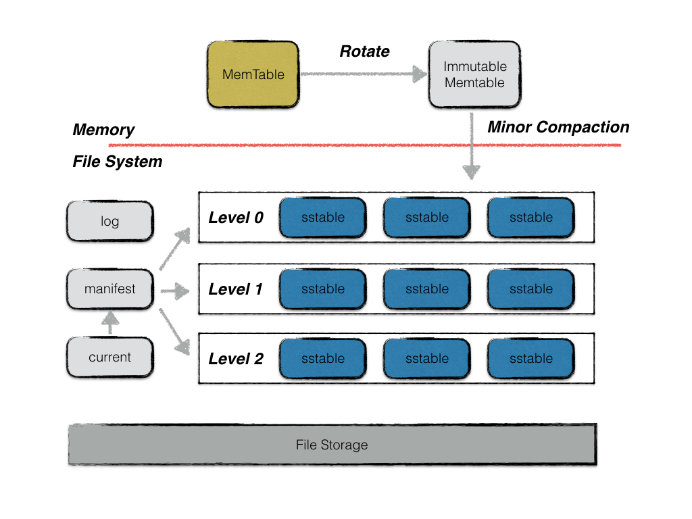
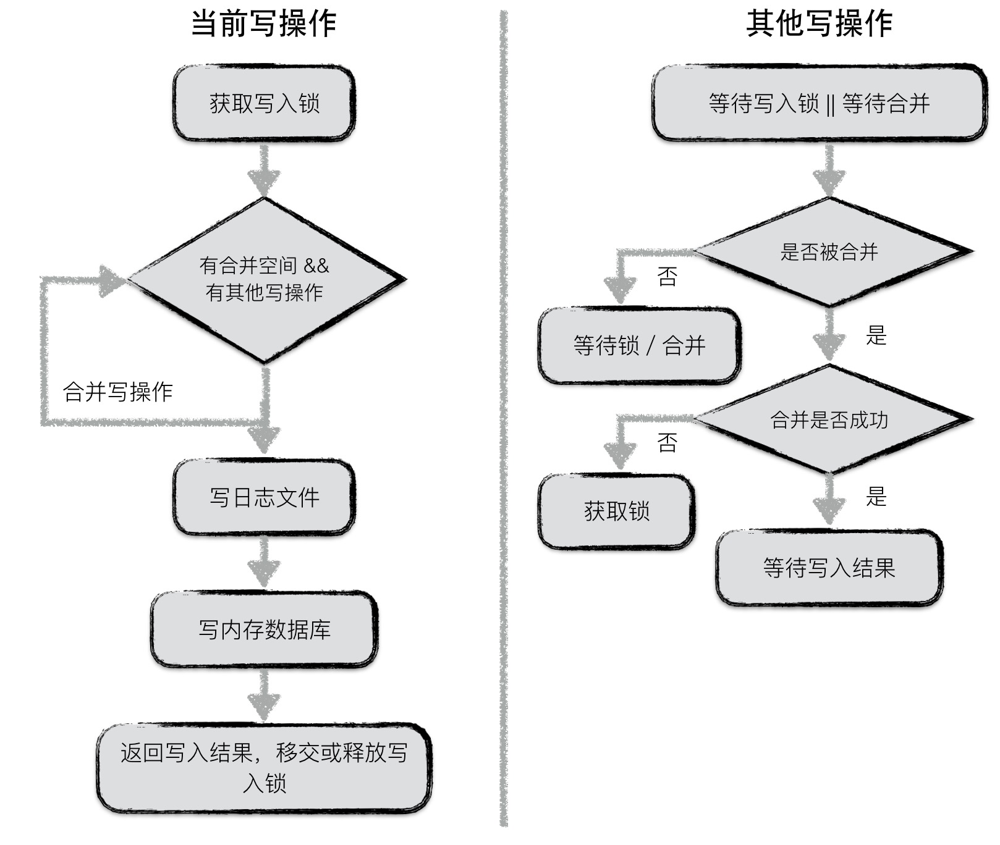
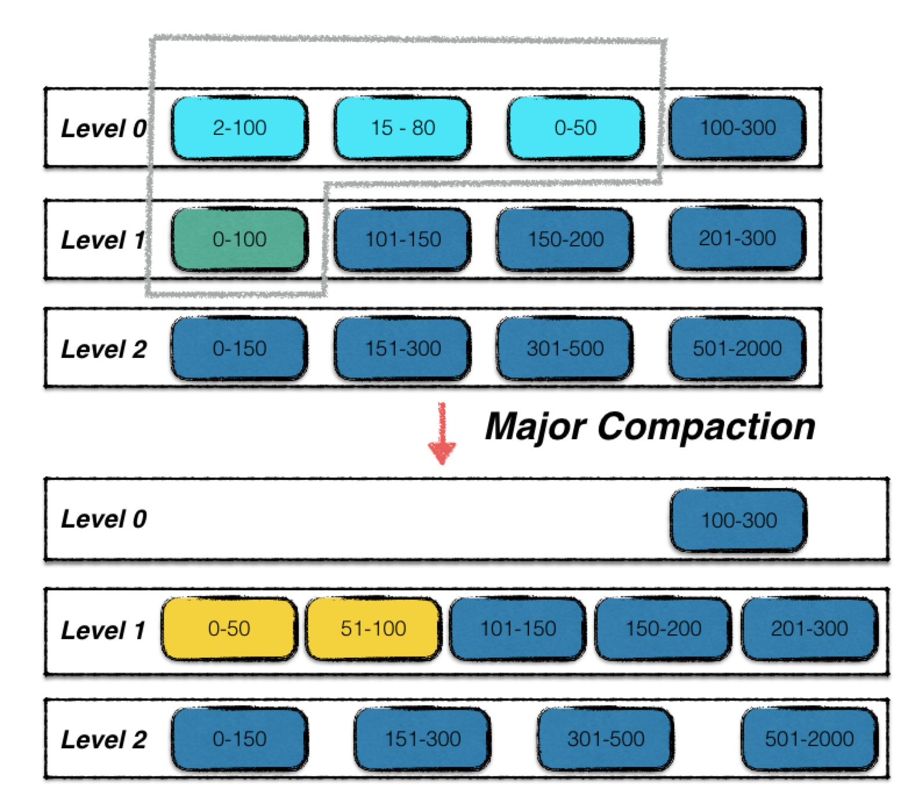
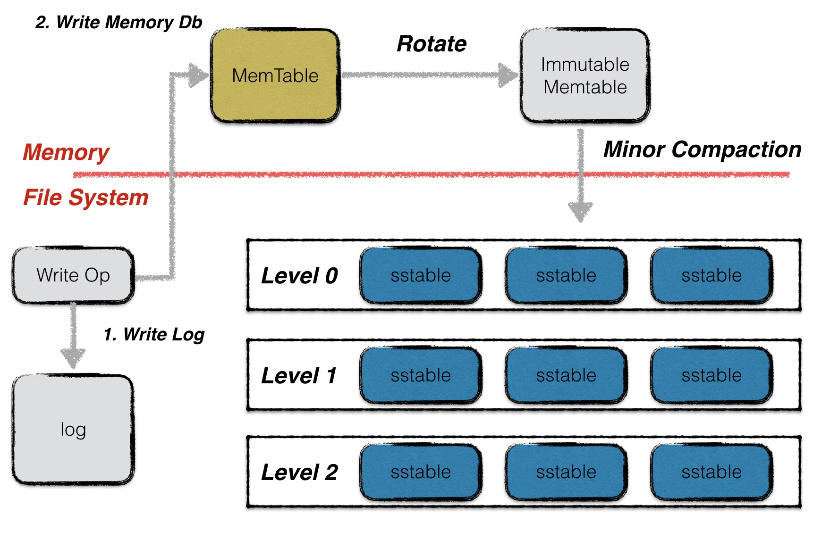
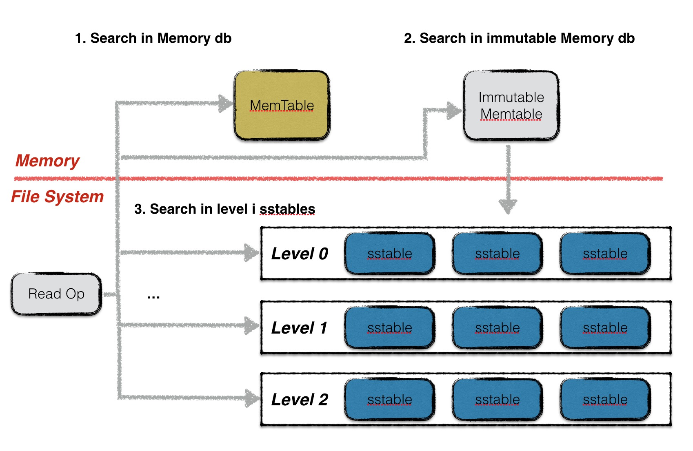

# LevelDB

- [LevelDB](#leveldb)
  - [概念](#概念)
  - [架构](#架构)
    - [写操作](#写操作)
    - [读操作](#读操作)
    - [Compaction](#compaction)
  - [特性思考](#特性思考)
  - [性能瓶颈与优化](#性能瓶颈与优化)
  - [使用场景](#使用场景)
  - [性能测试与对比](#性能测试与对比)
  - [参考](#参考)

## 概念

> [LevelDB](https://github.com/google/LevelDB)是Google开源的持久化KV(NoSql)单机数据库，具有很高的随机写、顺序读/写性能，是典型的LSM树(Log Structured-Merge Tree)实现。LSM树的核心思想就是放弃部分读的性能，换取最大的写入能力。

LSM树写性能极高的原理，简单地来说就是尽量减少随机写的次数。对于每次写入操作，并不是直接将最新的数据驻留在磁盘中，而是将其拆分成（1）一次日志文件的顺序写（2）一次内存中的数据插入。LevelDB正是实践了这种思想，将数据首先更新在内存中，当内存中的数据达到一定的阈值，将这部分数据真正刷新到磁盘文件中，因而获得了极高的写性能（官方宣称顺序写60MB/s, 随机写45MB/s）。

## 架构

LevelDB主要由六个部分构成，如下图所示：

   

       
   

- **MemTable(wTable)**：基于**SkipList**实现的内存数据结构，接受用户的读写请求，新的数据修改首先在这里写入。
- **Immutable MemTable(rTable)**：当MemTable大小达到阈值，会生成一个Immutable MemTable，只接受读操作，不接受写操作，后续由后台线程持久化(Flush)到磁盘。与此同时生成一个新的MemTable。
- **SST(Sorted String Table) Files**：磁盘数据存储文件。LevelDB中有Level(0~N)层，Level0由rTable直接Flush得到，其他Level由上一层`Compaction`得到。
- **Manifest Files**：该文件记录SST文件在不同Level中的分布，包括单个SST文件的最大、最小key以及其他元信息。LevelDB支持snapshot，需要维护多个版本，可能存在多个Mnifest File。
- **Current File**：由于可能存在多个Mnifest Files，需要一个额外的Current File来记录当前Manifest文件名。
- **Log Files**：日志文件，防止MemTable数据丢失（WAL、保证持久性）

### 写操作

**写操作流程**：

一次写入操作可分为两大流程：

1. 将[**写操作**]写入日志（顺序写）
2. 在内存数据结构中应用该写操作
   1. 写入MemTable；
   2. 当MemTable达到设定阈值时，转换为Immutable Memtable；
   3. 后台线程将Immutable Memtable异步刷盘，成为Level0上的一个SST文件；
   4. 后台线程基于某些条件出发对Level(0~N)的文件进行`Compaction`。

**写类型**：

> LevelDB对外提供的写入接口有：（1）Put（2）Delete两种。这两种本质对应同一种操作，Delete操作同样会被转换成一个value为空的Put操作。

LevelDB提供了一个批量处理的工具Batch，用户可以依据Batch来完成批量的数据库更新操作，且这些操作是原子性的。在batch中，每一条数据项都按照下图格式进行编码。

    

实际上，无论是Put/Del操作，还是Batch操作，底层都会为这些操作创建一个Batch实例作为一个数据库操作的最小执行单元。

**写合并**：

在面对并发写入时，做了一个处理的优化。在同一个时刻，只允许一个写入操作将内容写入到日志文件以及内存数据库中。为了在写入进程较多的情况下，减少日志文件的小写入，增加整体的写入性能，LevelDB将一些“小写入”合并成一个“大写入”。
具体流程如下：

    

- **第一个获取到写锁的写操作**
  1. 第一个写入操作获取到写入锁；
  2. 在当前写操作的数据量未超过合并上限，且有其他写操作pending的情况下，将其他写操作的内容合并到自身；
  3. 若本次写操作的数据量超过上限，或者无其他pending的写操作了，将所有内容统一写入日志文件，并写入到内存数据库中；
  4. 通知每一个被合并的写操作最终的写入结果，释放或移交写锁；
- **其他写操作**
  1. 等待获取写锁或者被合并；
  2. 若被合并，判断是否合并成功，若成功，则等待最终写入结果；反之，则表明获取锁的写操作已经oversize了，此时，该操作直接从上个占有锁的写操作中接过写锁进行写入；
  3. 若未被合并，则继续等待写锁或者等待被合并；

### 读操作

读操作的流程：

1. 读MemTable，如果存在则返回，否则进行下一步；
2. 读Immutable MemTable，如果存在则返回；
3. 按顺序读 Level(0~N)，如果存在则返回；
4. 返回不存在。

> LevelDB在每一层sstable中查找数据时，都是按序依次查找sstable的。
0层的文件比较特殊。由于0层的文件中可能存在key重合的情况，因此在0层中，文件编号大的sstable优先查找。理由是文件编号较大的sstable中存储的总是最新的数据。
非0层文件，一层中所有文件之间的key不重合，因此LevelDB可以借助sstable的元数据（一个文件中最小与最大的key值）进行快速定位，每一层只需要查找一个sstable文件的内容。

### Compaction

LevelDB的读写操作逻辑都相对简单，关键在于写入之后如何重新组织数据的内容和结构，LevelDB引入的方法叫做`Compaction`，在后台定时进行该操作，压缩和移动数据，从而提高磁盘利用率和查找效率。

> LevelDB是典型的LSM树实现，因此需要对内存中的数据进行持久化。一次内存数据的持久化过程，在LevelDB中称为*Minor Compaction*，除此之外LevelDB还有*Major Compaction*。

正如前面的提到，LevelDB是一个写效率十分高的存储引擎，存储的过程非常简单，只需要一次顺序的文件写和一个时间复杂度为O(log n)的内存操作即可。

相比来说，LevelDB的读操作就复杂不少。在内存中的一到两次读操作需要进行一个复杂度为O(log n)的查询操作。若没有在内存中命中数据，则需要在按照数据的新旧程度在0层文件中依次进行查找遍历。由于0层文件中可能存在overlap，因此在最差情况下，可能需要遍历所有的文件。

假设LevelDB中就是以这样的方式进行数据维护，那么随着运行时间的增长，0层的文件个数会越来越多，在最差的情况下，查询一个数据需要遍历所有的数据文件，这显然是不可接受的。**因此LevelDB设计了一个*Major Compaction*的过程，将0层中的文件合并为若干个没有数据重叠的1层文件**。

对于没有数据重叠的文件，一次查找过程就可以进行优化，最多只需要一个文件的遍历即可完成。因此，LevelDB设计compaction的目的之一就是为了提高读取的效率。

有了Minor Compaction和Major Compaction，所有的数据在后台都会被规定的次序进行整合。但是一次Major Compaction的过程其本质是一个多路归并的过程，既有大量的磁盘读开销，也有大量的磁盘写开销，显然这是一个严重的性能瓶颈。

LevelDB主要用两种Compaction：

- **Minor Compaction**：一次Minor Compaction非常简单，其本质就是将一个内存数据库中的所有数据持久化到一个磁盘文件中。。每次Minor Compaction结束后，都会生成一个新的sstable文件，也意味着LevelDB的版本状态发生了变化，会进行一个版本的更替。
- **Major Compaction**：如果只有Minor Compaction，那么levelDB空间占用和查询效率将相当难以接受，因此需要Major Compaction来重新组织磁盘里存储的数据。相比于minor compaction，major compaction就会复杂地多，Major Compaction的触发条件有：
  - 当0层文件数超过预定的上限（默认为4个）；
  - 当level i层文件的总大小超过(10 ^ i) MB；
  - 当某个文件无效读取的次数过多。

    

## 特性思考

1. **何为“Level”？**
   LevelDB中“**Level**”的含义在于：LevelDB在磁盘中维护了多层级（Level 0～N）的文件（SSTable文件，每个文件内部的key是有序的）。在每个Level上分布着多个SSTable文件，Level 0中的SSTable文件是直接由内存中的Immutable Memtable刷盘得到的，所以Level 0中的不同SSTable之间可能存在key重复；而Level 1~N中的SSTable文件是通过**Compaction**得到的。
   我们已经知道，LevelDB的写入过程十分简单，在日志写入完成后，只需在内存数据结构MemTable中写入（删除也只需对key写入一个删除标记）即可，MemTable写满后就会持久化刷盘变成一个SSTable文件，显而易见，这些初级的SSTable文件（Level 0中）之间是可能存在重复的。
   Compaction可以对SSTable文件进行整理压缩，删除重复的KV数据。通过Compaction操作，将多个SStable文件压缩成一个，并放置在下一个Level上，如此往复，便形成了多个“Level”。
2. **为什么快？**
    官方号称LevelDB的随机写性能可以达到40万条记录每秒，随机读性能可以达到6万条记录每秒。为什么LevelDB并不是纯内存的，写性能可以如此之快，又为什么随机读的性能会比随机写的性能更低呢？

   - **写入**：对于一个插入操作`Put(Key,Value)`来说，完成插入操作包含两个具体步骤：

     1. 首先是写log文件，将这条KV记录以**顺序写**的方式追加到log文件末尾，尽管这是一个磁盘读写操作，但是采用文件的**顺序追加写入方式效率很高**；
     2. 如果log文件写入成功，那么将这条KV记录插入内存中的Memtable中，其底层是一个Key有序的SkipList（跳表），插入过程十分高效。完成这一步，写入记录就算完成了，所以一个插入记录操作涉及**一次磁盘文件追加写和内存插入操作**，所以LevelDB的写入性能极高。

   

       
   

   - **读取**：相比于写入，LevelDB中的读取过程更加复杂，数据可能存在于两个地方：内存中或磁盘中。所以在查找时，会按照以下三步进行：先查找Memtable，若没有查到则找Immutable Memtable，没查到则找SSTFiles。如果某个数据在SSTFiles中了，那么查找的速度就会比写入慢很多。具体流程如下图所示：

   

       
   

   为了加快读取速度，LevelDB引入了LRUCache来加速读取，由于SSTable文件是只读的，所以并不用关心数据一致性的问题。

3. **可靠性**
   - Redis因其高性能与易用性广受开发者青睐，但是由于Redis是纯内存数据库，在海量数据对情况下对内存占用较高，并且更多用于缓存使用，而不作为一个独立的数据库，虽然Redis提供了RDB持久化机制，但RDB实质是数据快照的形式，并不是实时保存的，不能完全保证数据安全性，而采用AOF持久化机制又会带来崩溃后恢复时间较长的问题。
   - LevelDB的数据同时存储在内存和磁盘中，数据写入时先写内存，然后异步存入磁盘中。LevelDB的内存占用情况不会像Redis一样随数据量增大而线性增大。
   - 数据再刷盘之前，是存储在内存中的（Memtable和Immutable Memtable），如果还未刷盘程序就宕机了，可以通过日志文件进行恢复。LevelDB的写入流程是先顺序写磁盘日志，再写入内存，从而能够保证数据可靠性（但如果日志文件还没有被操作系统刷盘，机器宕机了，数据仍有可能丢失）。

## 性能瓶颈与优化

- **Compaction**：Compaction操作是对磁盘中的数据进行的，当Level 0 中的文件数量达到阈值时（默认是4），就会触发一次Major Compaction，如果此时写入速度非常快，*超过了Compaction的速度*，就会造成Level 0中的SSTable文件数量一直增长。一直增长会带来两方面的主要问题：其一是读性能急剧降低，其二是占用过多的存储空间。实际上，LevelDB有两个Trigger：
  - 当0层文件数量超过`SlowdownTrigger`时，写入的速度减慢
  - 当0层文件数量超过`PauseTrigger`时，写入暂停，直至Major Compaction完成。
- **Compaction策略**：Compaction操作会带来大量磁盘IO开销，这可能影响写入和读取速度，所以进行Compaction操作的时机与策略至关重要。例如，如何设置各个Level的文件阈值、尽量错峰进行Compaction等。
- **单机限制**：LevelDB是一个KV存储框架，并没有提供分布式能力，单机的通信和IO能力可能存在瓶颈，可以引入分布式架构，利用主从/集群架构实现读写分离和数据分片，可在特定场景下提高数据库性能。

## 使用场景

从前文的分析，我们已经知道：LevelDB的写入性能极高，而读取性能相对较弱。所以LevelDB适用于写多读少的场景，尤其是需要高性能的持久化数据存储，但不需要过于复杂的查询和事务处理的场景。例如：

1. 日志存储和分析系统：LevelDB适合用于存储和分析大量的日志数据。它可以高效地处理大量的写入操作，并支持按时间范围进行查询和检索。
2. 需要存储大量数据，但查询次数相对较少的场景：例如视频网站为了实现多端续播，需要实时写入用户的观看记录（写请求很多），而用户重新观看时只需读取一次历史观看位置（写请求较少）。

## 性能测试与对比

*Todo...*

## 参考

1. [LevelDB-github](https://github.com/google/LevelDB)
2. [LevelDB-handbook](https://LevelDB-handbook.readthedocs.io/zh/latest/index.html)
3. [LevelDB从入门到原理详解](https://cloud.tencent.com/developer/article/1602204)
4. [LevelDB日知录](https://github.com/1Feng/LevelDB-annotated/blob/master/doc/LevelDB%E6%97%A5%E7%9F%A5%E5%BD%95.pdf)