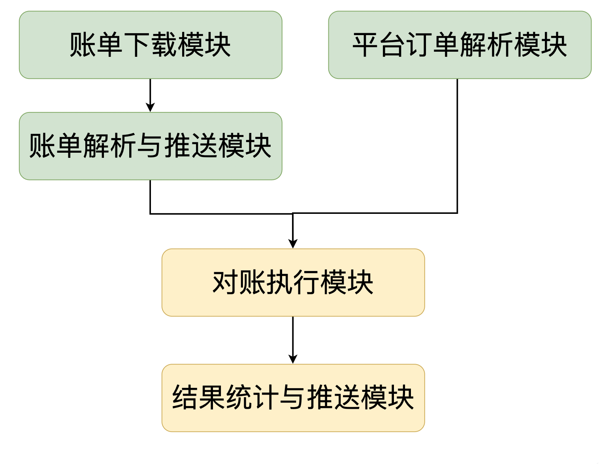

# 商城平台与金融系统的对账审计系统调研

## 背景与需求分析

> 系统订单与支付平台账单可能因数据错误、延迟等原因而出现账单不一致，需按特定时间（日级，小时级甚至分钟级）进行账单核对，避免出现严重误差，影响平台正常运行。

## 问题与挑战

1. **海量数据**
   对账系统的核心要求是对账准确率，需设计出完备准确的对账模块。商城平台每日订单与支付流水订单记录量可能是百万甚至千万级别，因此还需要考虑**对账时间**和在**海量数据**情况下的对账准确率。在海量数据场景下需要考虑分批次处理、内存或缓存分配管理，需尽量缩短对账时间，以避免数据时效性问题并减少对账对系统带来的影响。
2. **订单数据接口**
   商城平台实际的支付渠道多种多样，可覆盖支付宝、微信、云闪付等支付平台，其对账数据存在**异构性**。因此要设计出一套可自定义拓展的账单处理接口，实现插件式账单数据处理能力。
   同时可能存在数据解析、序列化/反序列化场景，应设计适当流程，尽量减少序列化/反序列化次数，并选择合适的序列化工具。
3. **准确性与可靠性**
   对账系统一般被视作平台数据安全性的最后一道屏障，部分被业务代码遗漏的问题只能在对账系统中核对发现，所以对账系统有很高的准确性与可靠性要求。

## 主要模块

按照主要职责，可将对账系统划分为 5 个模块（服务）：账单下载模块、解析与推送模块、平台订单解析模块、对账执行模块、结果统计与推送模块。此外还需实现一个模块（服务）间信息传输的中间模块，可采用 RPC 或消息队列。

  

为了更加明确各个模块间的功能和关系，可采用状态机对系统状态进行定义，并明确各个模块的依赖和时序关系。(*Todo...*)

- **账单下载模块**
  主要完成外部支付渠道账单下载，可定时执行任务，需设计可扩展的接口，实现不同渠道账单文件下载功能热插拔，实现新渠道快速接入。
- **账单解析与推送模块**
  主要完成账单记录的解析与推送。需将不同平台的原始账单文件转化为“对账执行模块”所需的输入格式。支付宝账单为 csv 格式，微信支付账单为 txt 格式，需针对不同格式编写具体解析代码，同账单下载模块，需设计成可扩展的接口。
- **平台订单解析模块**
  完成商城平台订单（内部）数据的解析，数据订单不会出现多渠道和异构的情况。在模块设计过程整应着重考虑**数据量**和**并发问题**。海量数据场景下直接读取数据库不可取。可考虑采用缓存或其他存储引擎（如 Hive、HBase、rocks DB 等）、分批读取等方式优化数据读取过程。
- **对账执行模块**
  *Todo...*

> *note*：数据处理过程中可能出现多次序列化/反序列化操作与中间对象生成，而这些过程是时间、空间不友好的。所以在实际的传输与解析过程中可以考虑**减少序列化次数**或**针对字符文件等中间文件直接进行解析**，提高解析速度。

- **结果统计与推送模块**
  对账执行完成后，需统计结果数据。对账结果可能回存在以下几种类型的异常：
  - 金额不一致：订单的显示金额与支付金额不一致；
  - 状态不一致：平台已支付但订单状态未同步，或已退款订单状态未更新；
  - **日切**：由于账单、订单数据可能是按日划分的，所以可能存在数据日切问题，即账单和订单数据不在同一天。这种异常是并不是不一致异常，需额外处理，可选择将此数据设置为[存疑]状态并存入另外的数据结构，在后续重新处理。
  - 少账/多账：排除日切差异后，可能存在“只有账单没有订单”或“只有订单没有账单”的情况，即少账/多账。

- **消息传输模块**
  可采用消息队列作为消息传输模块，解耦各个功能模块并实现异步、数据削峰等。

## 完整流程

*Todo...*

## 优化

- **数据存储**
  海量数据的写入与读取是对账系统的一大挑战，直接写入读取MySQL可能造成对账运行时间过长的问题。
  - 缓存：使用如 Redis 等缓存中间件，减少数据库的写入读取压力。但海量数据也可能带来内存占用过多等情况。
  - 其他存储引擎：如 Hive 等大数据存储引擎或 RockDB 等高性能数据库。
- **历史数据**
  对账完成后部分异常可能需要人工介入处理，因此历史数据需要保留一段时间。设置后台定期清理或移动脚本，本地只保留近期数据（如近七天），避免历史数据占用空间过大。
- **并行处理与多线程优化**
  *Todo...*

## 性能分析

- **数据读写**
  海量数据的读写是十分耗时的，因此选择恰当的数据存储框架十分重要，简单使用缓存可能会造成内存占用过多等问题。
  拟采用RockDB 或 Hive 等实现数据读写。*Todo...*
- **消息传输**
  - 序列化/反序列化：应尽量减少序列化/反序列化次数，并选择高性能的序列化框架，如 ProtoBuf 等；
  - 消息传输：消息传输时，应选择高性能RPC框架（如 grpc）或消息队列（如 Kafka），若使用消息队列则需考虑高可用性，如队列集群和恰当的持久化时机等。
- **并发问题**
  *Todo...*

## 可靠性分析

- 模块宕机
- 消息队列宕机
- 数据规模与消息积压
